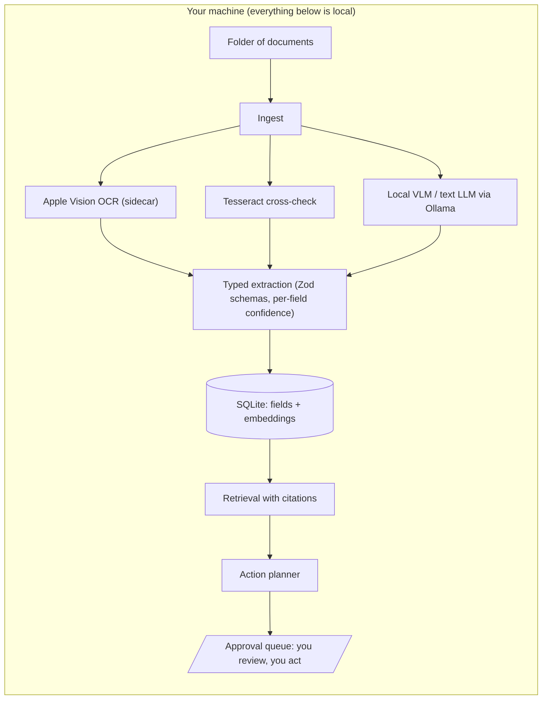

# Outtray

[](https://github.com/thehimmat/outtray/actions/workflows/ci.yml)

**Point it at the pile. Get an action list.**

Outtray is a local-first desktop assistant for the documents you have been
meaning to deal with: scans, PDFs, images, exported emails. It ingests a whole
folder of unsorted mess and produces the short list of things that actually
need your attention:

- **To-dos**: respond, pay, renew, submit, with deadlines.
- **Expiry alerts**: ID documents, policies, permits, trial periods.
- **Retention advice**: keep, shred, or trash, with a stated reason.
- **Attention flags**: probable phishing, unfavorable term changes, duplicate
  charges.

Every proposed item shows its reasoning, a verbatim snippet, and a link to the
exact source page. Nothing acts without your approval, and in v1 the app
cannot delete anything at all: it advises, you act.

First audience: people relocating internationally, whose paperwork arrives in
two languages, on deadlines, with real consequences.

## Why local

Your documents are the most sensitive data you own. All inference runs on
your machine; no document content leaves it by default.

### What leaves the machine

| Touchpoint | When | What | How to avoid |
| --- | --- | --- | --- |
| Ollama model download | When you install a model | Model weights fetched from the Ollama registry | Pre-pull models; the app never downloads silently |
| Cloud model (BYO API key) | Phase 5, opt-in, off by default | Until the opt-in UI exists, only eval fixture documents can ever reach a cloud provider, never yours | Do not add an API key |
| Telemetry | Never | Nothing | Nothing to do |

Details: [threat model](docs/THREAT_MODEL.md), [ADR-0007](docs/adr/0007-data-at-rest.md).

## Architecture



- `packages/core`: pure TypeScript domain logic (extraction, classification,
  orchestration, schemas). Never imports Tauri; runs under plain Node.
- `packages/evals`: the eval harness, fixtures, scorers, and scoreboard. The
  labeled fixture set is the test suite ([methodology](docs/evals/METHODOLOGY.md)).
- `packages/cli`: thin CLI over core; the demo surface until Phase 3.
- `packages/app`: Tauri v2 + React shell (lands in Phase 3).

All consequential decisions are recorded as [ADRs](docs/adr/).

## Roadmap

| Phase | Scope | Status |
| --- | --- | --- |
| 0 | Scaffold, CI, ADRs, threat model, eval methodology | Done |
| 1 | Extraction core: file in, typed fields + confidence out; eval harness, record/replay CI, scoreboard | Next |
| 2 | Retrieval plumbing: local embeddings, similarity search, citations (timeboxed) | |
| 3 | Action layer + approval queue; Tauri shell enters here; demo video | |
| 4 | Eval deepening: held-out split, calibration, cost dashboard, degradation paths | |
| 5 | Packaging: signed build, onboarding, BYO cloud key, landing page | |
| 6+ | Explicitly deferred: mobile, web, sync, Windows/Linux, monitoring | |

## Development

```sh
pnpm install
pnpm test        # Vitest, no model calls
pnpm lint        # Biome
pnpm typecheck   # tsc project references
pnpm build
```

Model-dependent evals run on a dev machine with Ollama (`pnpm eval:live`,
lands in Phase 1); CI replays recorded model outputs and never runs a model.

## License

[MIT](LICENSE)
